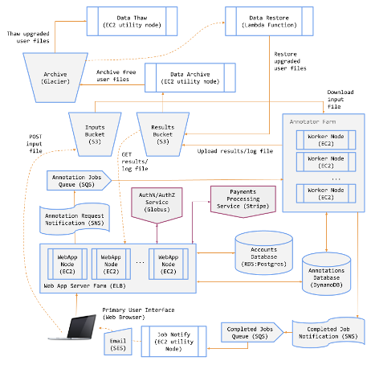

# Genetic Analytics Platform on AWS
A fully deployed cloud-based platform entirely on AWS that enables users to run genetic analysis.

AWS Services used:
- EC2
- S3
- SQS
- SNS
- DynamoDB
- Lambda Functions
- Step Functions
- Glacier
